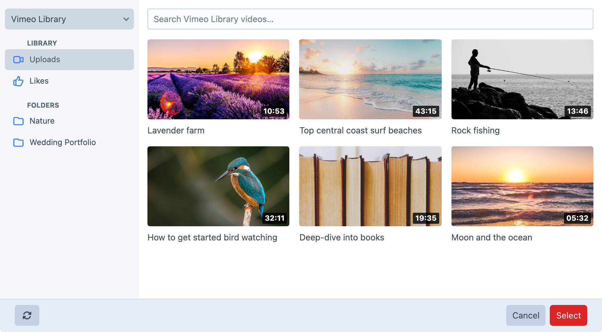
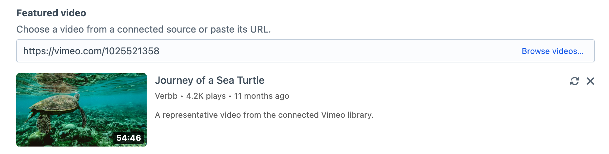
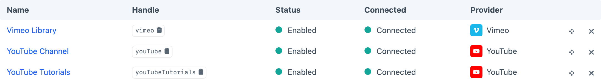

<!-- feature-intro -->
A visual field for finding and selecting hosted video. Connect YouTube or Vimeo sources, browse account collections or paste a URL, then hand templates useful video data instead of an opaque string.
<!-- feature-intro-end -->

<!-- feature-section media-size="large" -->
## Explore your videos

Connect a source and explore liked videos, uploads and collections. Search more widely where the provider allows it or paste a known URL, with thumbnails and metadata to confirm the right video before saving.

<!-- feature-section-end -->

<!-- feature-grid -->
- :icon[database] **Layered caching** Cache source listings, video metadata and resolved records to reduce provider requests.
- :icon[layout-cards] **Element cards** Show selected videos with useful thumbnails and links in supported Craft element cards.
- :icon[code] **Template-ready data** Use video metadata, embed URLs and responsive embed HTML in Twig or GraphQL.
<!-- feature-grid-end -->

<!-- feature-section media-size="large" media-shadow="false" -->
## A useful field at a glance

Once a video is selected, its thumbnail and metadata remain visible in the field. Editors can confirm the saved choice without reopening the explorer when they return to the entry later.

<!-- feature-section-end -->

<!-- feature-section media-size="large" -->
## Multiple video sources

Configure multiple YouTube and Vimeo sources for different channels or clients, then decide which sources are available to each field. Developers can register another source type or extend existing behaviour through events.

<!-- feature-section-end -->
