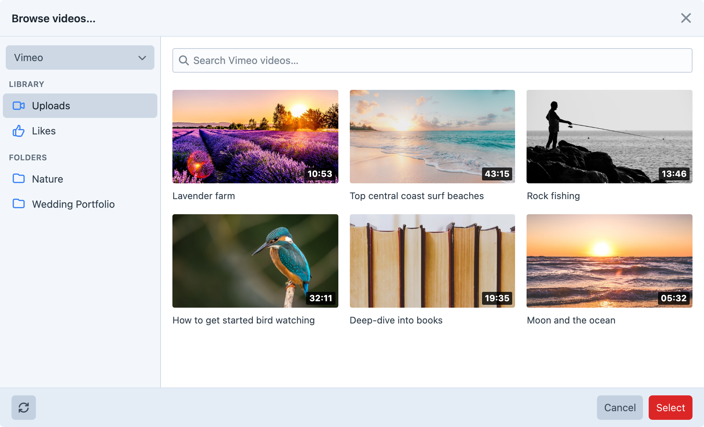
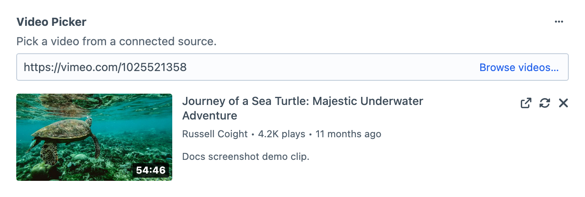
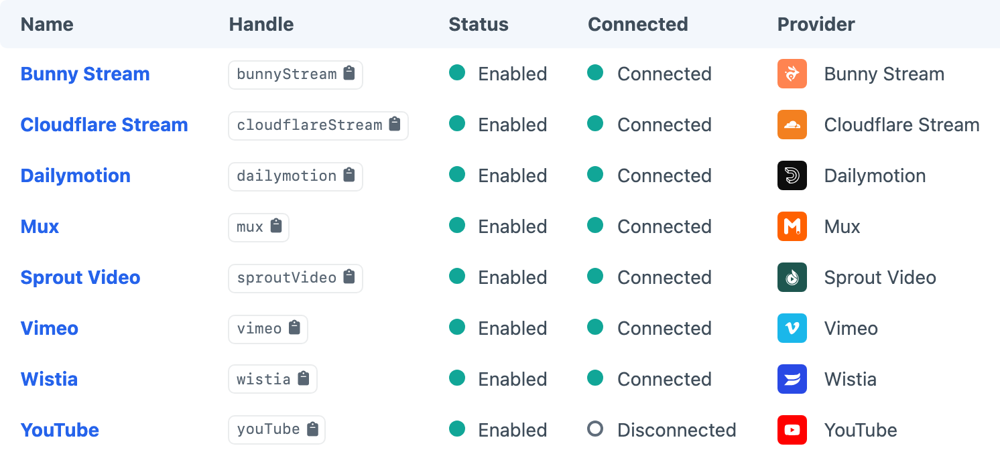

<!-- feature-intro -->
A visual field for finding and selecting hosted video. Connect supported provider sources, browse account collections or paste a URL, then hand templates useful video data instead of an opaque string.
<!-- feature-intro-end -->

<!-- feature-section media-size="large" -->
## Explore your videos

Connect a source and explore liked videos, uploads and collections. Search more widely where the provider allows it or paste a known URL, with thumbnails and metadata to confirm the right video before saving.

<!-- feature-section-end -->

<!-- feature-grid -->
- :icon[adjustments] **Field-level choices** Decide which sources authors can use, whether they can paste URLs or search public videos, and which duration or sorting limits apply.
- :icon[database] **Resilient provider data** Cache source listings, video metadata and resolved records, retaining the last successful details through temporary provider failures.
- :icon[code] **Template-ready data** Use video metadata, embed URLs and responsive embed HTML in Twig or GraphQL.
<!-- feature-grid-end -->

<!-- feature-section media-size="large" media-shadow="false" -->
## A useful field at a glance

Once a video is selected, its thumbnail and metadata remain visible in the field. Editors can confirm the saved choice without reopening the explorer when they return to the entry later.

<!-- feature-section-end -->

<!-- feature-section media-size="large" -->
## Your video platform, connected

Bring Bunny Stream, Cloudflare Stream, Dailymotion, Mux, Sprout Video, Vimeo, Wistia or YouTube into the same editorial workflow. Configure multiple accounts for different channels or clients without changing how authors find and select a video.

<!-- feature-section-end -->
